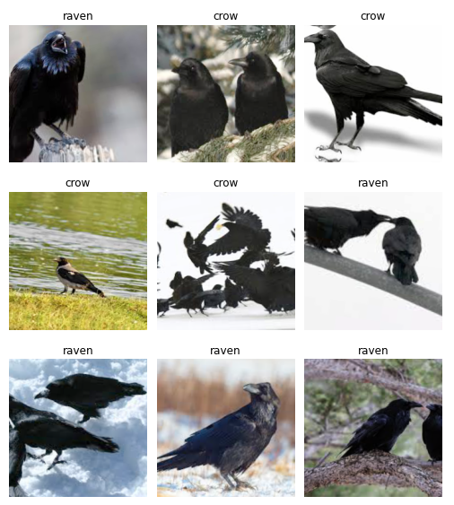
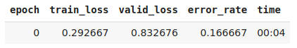

# crow_vs_raven

Model performed with __fastai__ library (v1).

Model trained using custom dataset created collecting images from Google. The dataset contains 200 pictures of crows, and the same amount of ravens.

- Results: With resnet50 as the architecture chosen, our model got an accuracy of __83.34%.__

_error_rate showed instead (error_rate = 1 - accuracy)._
